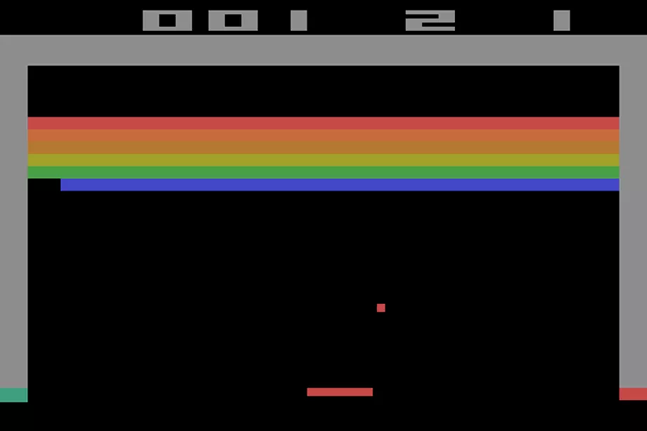

# Breakout

Copy of retro game Breakout:

-----

## Game consits of: 
- Initial menu
    - menu with select options:
      - game
      - show score
- Gameplay
    - Player has 3 lives
    - 3-6 rows of bricks
        - each row has different point value
    - After reaching certain score ball speed increases
    - Game ends after reaching zero lives or destroying all bricks
   
- End Screen
    - Win/Loose info
    - Score displayed
    - score is saved locally on ram, top 3 players
    - Play again button

## Controls
- Menu
    - buttons
- Game
    - joystick left/right movement
    - joystick up/down begin game/move ball
